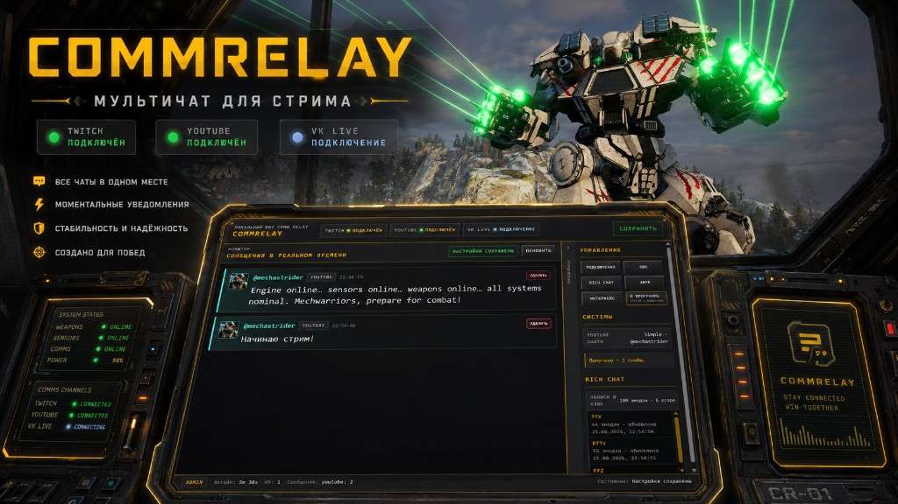

# CommRelay

**Язык / Language:** [Русский](README.md) · [English](README.en.md)

[](https://github.com/mechastrider/comm-relay/actions/workflows/ci.yml) [](https://github.com/mechastrider/comm-relay/releases)  [](LICENSE)   [](https://wails.io/) [](https://www.donationalerts.com/r/mechastrider)

CommRelay — локальная интерактивная система для стримов. Она объединяет чат Twitch, YouTube Live и VK Live, помогает видеть вклад зрителей и выводит в OBS чат, лидерборд, команды и награды — без облачного relay-сервера.

До **v0.5** CommRelay был прежде всего мультичатом. Начиная с v0.5 приложение перерабатывается в систему, где сообщения становятся событиями стрима: зрители получают прогресс, команды запускают баннеры, а стример может отмечать вклад участников наградами.

> [!WARNING]
> Интерактивная система находится в экспериментальном режиме, постоянно меняется и дорабатывается. Возможности, интерфейс и модель прогресса могут заметно меняться между релизами — перед обновлением проверяйте [CHANGELOG.md](CHANGELOG.md) и делайте резервную копию пользовательских данных.



## Посмотреть в действии

Лучший способ оценить CommRelay — посмотреть, как система работает на авторских стримах:

- [Twitch — mechastrider](https://www.twitch.tv/mechastrider)
- [VK Live — mechastrider](https://live.vkvideo.ru/mechastrider)
- [YouTube — @mechastrider](https://www.youtube.com/@mechastrider/streams)

## Что умеет

- Объединяет Twitch, YouTube Live Chat и VK Live / VK Video в одну локальную ленту.
- Ведёт статистику зрителей (XP, сообщения, сессия/день/всё время) в локальной базе `comm-relay.db` рядом с `config.json` — отдельный сервер БД не нужен.
- Распознаёт команды чата и позволяет стримеру выдавать награды зрителям прямо из Live или журнала OBS dock.
- Выводит в OBS прозрачные поверхности чата, лидерборда и баннеров команд/наград.
- Встраивает отдельный журнал сообщений в интерфейс OBS: `http://127.0.0.1:17877/dock/messages`.
- Показывает прозрачный лидерборд для OBS: `http://127.0.0.1:17877/overlay/leaderboard?period=session|day|all` (та же тема, что у чата; без `preset` следует за активным пресетом).
- Показывает баннеры команд и наград на отдельном OBS Browser Source: `http://127.0.0.1:17877/overlay/alert` (звук в этом источнике; для эфира включите **Control audio via OBS**).
- Даёт локальную панель с рабочими местами Live, Audience, Studio и Settings: статусы, сообщения, зрители, каталоги команд и наград, подготовка overlay и диагностика.
- В **Settings → Данные** можно скрыть строки `!команд` только в overlay чата — в Live и dock они остаются.
- Поддерживает Twitch emotes, FrankerFaceZ, BetterTTV, 7TV и безопасные превью картинок.
- Автоматически переподключает коннекторы и хранит настройки локально в `config.json`.


## Скачать и установить

Готовые сборки публикуются на странице [GitHub Releases](https://github.com/mechastrider/comm-relay/releases). Для обычного использования Go, Node, Docker и база данных не нужны.

Выберите архив под вашу систему:


| Система            | Файл релиза                            | Запуск                                                                                                                                                      |
| ------------------ | -------------------------------------- | ----------------------------------------------------------------------------------------------------------------------------------------------------------- |
| Windows 11, 64-bit | `CommRelay-vX.Y.Z-windows-amd64.zip`   | Распакуйте архив и запустите `CommRelay.exe`.                                                                                                               |
| macOS, 64-bit      | `CommRelay-vX.Y.Z-macos-universal.zip` | Распакуйте архив и откройте `CommRelay.app`.                                                                                                                |
| Linux, 64-bit      | `CommRelay-vX.Y.Z-linux-amd64.tar.gz`  | Распакуйте архив, сделайте файл исполняемым и запустите `./CommRelay`. При первом запуске приложение само добавит иконку в меню (Linux Mint, Ubuntu и др.). |


Windows и macOS могут предупредить, что приложение не подписано. Это ожидаемо для раннего релиза: на macOS используйте **Open** через контекстное меню Finder, на Windows подтвердите запуск через **More info** → **Run anyway**.

### Linux зависимости

На Linux desktop-сборке нужны системные библиотеки GTK/WebKit. Для Ubuntu/Debian:

```bash
sudo apt update
sudo apt install libgtk-3-0 libwebkit2gtk-4.1-0
```

Если в вашем дистрибутиве нет пакета `libwebkit2gtk-4.1-0`, установите эквивалент WebKitGTK 4.1 из репозитория дистрибутива.

### Иконка в меню Linux (Mint, Ubuntu, …)

На Linux иконка приложения не вшивается в бинарник — окружение рабочего стола читает файл `.desktop`. CommRelay при первом запуске сам ставит запись в `~/.local/share/applications/` и PNG-иконку. Если иконка не появилась сразу, перезапустите панель или выйдите из сеанса и войдите снова.

Вручную из распакованного архива:

```bash
chmod +x CommRelay install-desktop.sh
./install-desktop.sh
```

Не переносите папку с `CommRelay` после установки ярлыка без повторного запуска `./install-desktop.sh` (или без повторного запуска приложения) — путь в `.desktop` должен указывать на актуальный бинарник.

## Первый запуск

1. Запустите приложение. Откроется окно CommRelay, а внутри поднимется локальный сервер.
2. Откройте **Settings → Platforms** (Настройки → Платформы) и включите нужные платформы.
3. Нажмите **Сохранить** у этой секции после изменения настроек.
4. Откройте **Studio**: при первом заходе откроется **Подключение к OBS** с шагами Browser Source и копированием URL; затем настройте внешний вид поверхностей (чат, лидерборд, баннеры).

По умолчанию CommRelay слушает `127.0.0.1:17877`. Админка доступна по `http://127.0.0.1:17877/`, а overlay по `http://127.0.0.1:17877/overlay`.

## OBS Browser Source

1. В CommRelay откройте **Studio**: список поверхностей эфира (чат, лидерборд, алерты) можно свернуть до иконок на широком экране; на узком он остаётся горизонтальным. Кнопка **Подключение к OBS** открывает шаги Browser Source и все копируемые URL.
2. В режиме **Основное** выберите поверхность и нажмите **Копировать ссылку OBS** — или откройте **Подключение к OBS** и скопируйте URL нужного источника. В OBS добавьте **Browser** (чат, лидерборд, алерты) или Custom Browser Dock (журнал сообщений).
3. Основной URL чата, лидерборда и алертов **не** содержит `?preset=` — источник обновляется при смене активного пресета. Для сцены с фиксированным видом перейдите во **Все настройки** и скопируйте закреплённый URL (**Pinned preset**) в параметрах превью либо в **Подключении к OBS**. У лидерборда также есть `period` и при необходимости `layout` / `font_size_px`.
4. Для **Алертов** (`/overlay/alert`) добавьте отдельный Browser Source поверх сцены. Звук баннера проигрывается в этом источнике — чтобы слышать его в записи и эфире, включите **Control audio via OBS** у источника.
5. Задайте размер под ваш макет сцены. Не добавляйте фон вручную: источники на сцене уже прозрачные.
6. Оставьте CommRelay запущенным во время стрима.

Если вы поменяли порт в настройках, обновите URL в OBS.

## Журнал сообщений в интерфейсе OBS

CommRelay может показывать отдельную ленту чата прямо в интерфейсе OBS. Эта панель предназначена для стримера: она не попадает в сцену и не видна зрителям.

1. В CommRelay откройте **Studio** → **Подключение к OBS**, выберите **Журнал сообщений** и нажмите **Копировать URL**.
2. В OBS откройте **View → Docks → Custom Browser Docks…** (**Вид → Док-панели → Пользовательские браузерные доки…**).
3. Введите название, например `CommRelay Messages`, и вставьте скопированный URL.
4. Нажмите **Apply**, затем разместите новую панель в удобной части интерфейса OBS.

Панель показывает только сообщения: при открытии восстанавливает до 100 последних записей, затем получает новые в реальном времени. Если вы прокрутили журнал вверх, новые сообщения не сбрасывают позицию; чтобы вернуть автопрокрутку, прокрутите ленту вниз. Кнопка **Удалить** (Delete) удаляет запись из локальной истории, админки, dock и активного overlay. Кнопка **Reward** (Награда) выдаёт награду зрителю из каталога в **Audience** — как в Live.

Если порт CommRelay изменён, замените `17877` в URL. Приложение должно оставаться запущенным во время стрима. Для вывода сообщений зрителям по-прежнему используйте отдельный источник **Browser** с URL `/overlay`.

## Настройки overlay

Откройте **Studio** в панели управления CommRelay.

Режим **Основное** оставляет ежедневный путь: поверхность, превью, пресет, тема, шрифт, длительность или период и публикация. **Все настройки** показывает параметры превью, закреплённые URL, расширенный инспектор и управление пресетами. Оба режима используют один черновик — переключение ничего не сбрасывает.


| Настройка        | Что делает                                                                                                                                                                                                                                                                     |
| ---------------- | ------------------------------------------------------------------------------------------------------------------------------------------------------------------------------------------------------------------------------------------------------------------------------ |
| **Макс. сообщений** (Max messages) | Сколько последних сообщений держит overlay на экране.                                                                                                                                                                                                                          |
| **TTL сообщения** (Message TTL) | Сколько сообщение остаётся на экране: чипы **8 с**, **20 с** или **Пока не вытеснят** (0 — не удалять по времени). Произвольное значение — в **Ещё настройки**. |
| **Размер шрифта** (Font size) | Размер текста в overlay, от **12 до 48 px**.                                                                                                                                                                                                                                   |
| **Отступы** (Spacing) | **Comfortable** — обычные отступы. **Compact** — плотнее, если на экране много строк.                                                                                                                                                                                          |
| **Тема** (Theme) | **Default** — карточки с полупрозрачным фоном. **Text only (без фона)** — только текст. **Cockpit panel** — общая HUD-панель. **Cockpit popups** — отдельные всплывающие MW5 HUD-сообщения. **G-Rebels Cockpit popups** — всплывающие сообщения в золотом авиационном HUD-стиле. Та же тема оформляет чат и лидерборд. |
| **Пресеты** (Presets) | Именованный вид для сцены или игры: тема, лимит, TTL, плотность, край текста, маркер платформы, панель, отдельно шрифт и макет лидерборда (`panel` / `chips`). Старый `config.json` без пресетов превращается в пресет **Default**. |
| **URL Follow / Pinned** | На выбранной поверхности — **Копировать ссылку OBS** / Follow active preset (без `?preset=`). Закреплённый URL с `?preset=` — в режиме **Все настройки** или в **Подключении к OBS**. Старые источники с `preset` продолжают работать. |
| **Превью** | Список поверхностей слева переключает превью (**Чат / Лидерборд / Баннеры**); у лидерборда всегда примерный (вымышленный) топ-5. Фон превью (белый, шахматка, игровой кадр, чёрный) — в меню **Параметры превью** (⋯). |


После изменения внешнего вида в Studio:

1. Нажмите **Опубликовать** (Publish). Пока черновик не опубликован, эфирный overlay не меняется.
2. Для неактивного пресета **Включить в эфире** становится доступно после публикации — так CommRelay не активирует старую сохранённую версию вместо показанного в превью черновика.
3. Если источник закреплён (`?preset=`), обновите Browser Source в OBS: правый клик по источнику → **Refresh cache of current page**. Источник без `preset` подхватит активный пресет по WebSocket; при смене темы всё же обновите кэш, если картинка «залипла».

Без перезагрузки в OBS overlay продолжит работать со старыми параметрами.

**Совет:** чтобы сравнить темы, дождитесь нескольких сообщений в чате — на пустом экране разница не видна.

Для тем **Cockpit panel**, **Cockpit popups** и **G-Rebels Cockpit popups** размер панели задаётся размером самого Browser Source в OBS. Разместите источник поверх нужной области сцены, и тема растянется на этот прямоугольник.

**Чат должен выглядеть как ваш стрим, а не как чужой виджет.** Если нужна тема сообщений под бренд, игру или HUD-стиль — могу сделать оформление для OBS под вас. Пишите в [Telegram](https://t.me/mechastrider_apps/2).

## Язык интерфейса

В панели управления откройте **Settings → Application** (Настройки → Приложение) и выберите язык `Русский` или `English`. Админка и OBS dock используют выбранный язык и единый 24-часовой формат `ЧЧ:ММ:СС` без AM/PM.

## Настройка платформ

Все настройки платформ находятся в **Settings → Platforms** (Настройки → Платформы).

### Twitch

Включите Twitch и укажите название канала без `#`. OAuth не нужен: CommRelay читает публичный чат через Twitch IRC.

### YouTube Live

По умолчанию используется **Simple (URL видео)** — без Google Cloud и OAuth:

1. Укажите **Handle канала** (Channel handle) (`@name` или URL канала) — CommRelay сам найдёт текущий эфир.
2. Либо вставьте URL/ID конкретного live-видео (имеет приоритет над автопоиском).
3. Включите YouTube connector и сохраните настройки.

Для **API (OAuth)** (автоматическое чтение чата авторизованного аккаунта) выберите **Режим подключения** (Connection mode) → **API (OAuth)**:

1. Откройте [Google Cloud Console](https://console.cloud.google.com/).
2. Создайте OAuth client и включите **YouTube Data API v3**.
3. Добавьте redirect URI: `http://127.0.0.1:17877/oauth/youtube/callback`.
4. В CommRelay вставьте **OAuth client ID** и **client secret**, сохраните настройки.
5. Нажмите **Подключить** (Connect) — откроется системный браузер для входа Google. После успешной авторизации вернитесь в CommRelay.
6. Включите YouTube connector и сохраните настройки ещё раз.

В simple mode читается публичный live chat по URL. В API mode сообщения появятся, когда у авторизованного аккаунта идёт активный эфир с live chat.

Simple mode использует недокументированный InnerTube API (как веб-плеер YouTube). Формат может измениться без предупреждения; при проблемах попробуйте API mode.

### VK Live

OAuth не требуется. Укажите slug канала или URL `live.vkvideo.ru`, затем включите VK connector и сохраните настройки.

## Где хранятся настройки

Настройки, OAuth-токены и локальные параметры хранятся только на вашем компьютере.


| Система | Путь к `config.json`                                   |
| ------- | ------------------------------------------------------ |
| Windows | `%AppData%\comm-relay\config.json`                     |
| macOS   | `~/Library/Application Support/comm-relay/config.json` |
| Linux   | `~/.config/comm-relay/config.json`                     |


Не публикуйте `config.json`, если в нём есть OAuth client secret или токены.

## Обновление

Скачайте новый архив из [Releases](https://github.com/mechastrider/comm-relay/releases), закройте старое приложение и замените файлы приложения. Пользовательский `config.json` находится отдельно, поэтому настройки сохранятся.

Перед обновлением смотрите [CHANGELOG.md](CHANGELOG.md): там отмечены новые возможности, исправления и возможные ручные действия.

Подробнее по типичным сбоям overlay и OBS на Linux: [docs/FAQ.md](docs/FAQ.md).

## Частые проблемы

- **Меняю шрифт или тему — ничего не меняется**: в **Studio** нажмите **Опубликовать**, затем при необходимости обновите Browser Source в OBS. Размер шрифта — только от 12 до 48 px.
- **Отступы** (Spacing) и **Тема** (Theme) «одинаковые»: сравнивайте при активном чате; Compact заметнее при 5+ сообщениях; Text only лучше виден на зелёном или тёмном фоне сцены; Cockpit-темы рассчитаны на вывод поверх игрового кадра.
- **OBS ничего не показывает**: проверьте, что CommRelay запущен, URL в Browser Source совпадает с портом, а connector в админке имеет статус `подключён` (`connected`). На **Linux** при чёрном квадрате в Browser Source отключите аппаратное ускорение браузера в OBS (**Файл → Настройки → Расширенные → Источники**) — см. [docs/FAQ.md](docs/FAQ.md).
- **Порт 17877 занят**: закройте другое приложение на этом порту или запустите CommRelay с другим адресом через `-addr 127.0.0.1:<порт>`.
- **YouTube OAuth не проходит**: redirect URI в Google Cloud должен точно совпадать с портом из `config.json`. Нажмите **Подключить** (Connect) в режиме API — вход откроется в системном браузере, не во встроенном окне CommRelay.
- **Нет сообщений YouTube**: нужен активный эфир с включённым live chat; в simple mode проверьте URL видео.
- **Simple mode не подключается**: YouTube может показать consent/captcha — попробуйте API mode или обновите URL эфира.
- **macOS не открывает приложение**: ранние сборки не подписаны; используйте **Open** из контекстного меню Finder.
- **Linux не запускает окно**: установите GTK/WebKit зависимости из раздела Linux.


## Документация и разработка

- [Техническая документация для разработчиков](docs/development.md) — локальный запуск, проверки, Wails-сборка и release workflow.
- [Концепция продукта](docs/concept.md) и [roadmap интерактивной системы](docs/roadmap.md).
- [FAQ](docs/FAQ.md) — типичные проблемы с OBS, overlay и платформами.

## Поддержка и вопросы

- **Вопросы, предложения и пожелания** — [Telegram-чат поддержки](https://t.me/mechastrider_apps/2).
- **Исходники и issues** — [GitHub](https://github.com/mechastrider/comm-relay).
- В админке: **Settings → About** (Настройки → О программе) — версия и ссылки на поддержку.


### Тема сообщений под ваш стрим

Встроенные темы — только старт. Если нужен чат **в стиле вашего канала**, игры или сцены, могу сделать **тему сообщений для OBS** под вас: цвета, шрифты, HUD, попапы. Напишите в [Telegram](https://t.me/mechastrider_apps/2) — обсудим референсы и что должно попасть в кадр.

## Поддержка автора

CommRelay — бесплатный open-source проект. Если приложение помогает вашим стримам, можно поддержать автора через [DonationAlerts](https://www.donationalerts.com/r/mechastrider):

[DonationAlerts](https://www.donationalerts.com/r/mechastrider)

## Лицензия

Проект распространяется под [MIT License](LICENSE). Copyright (c) 2026 Igor Lazarev.
